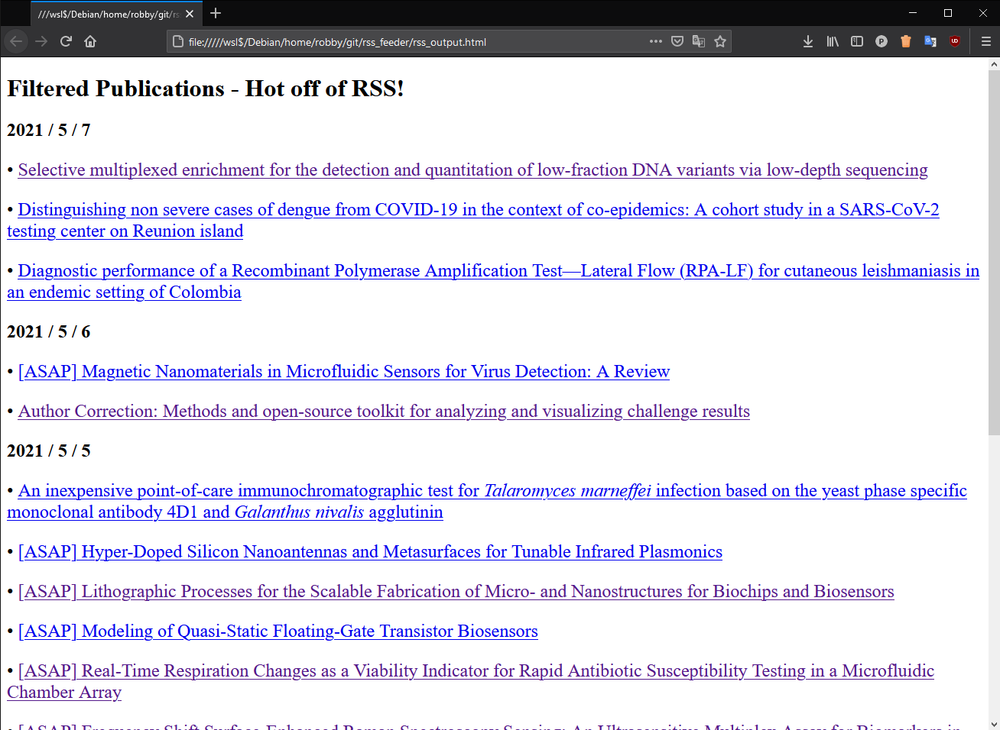
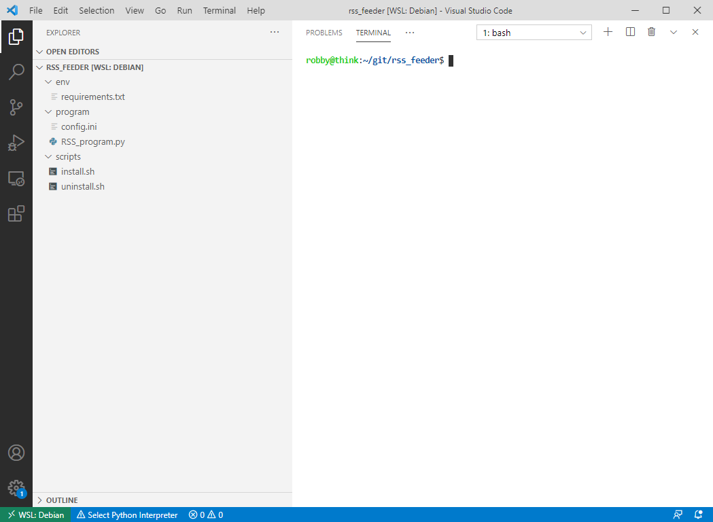
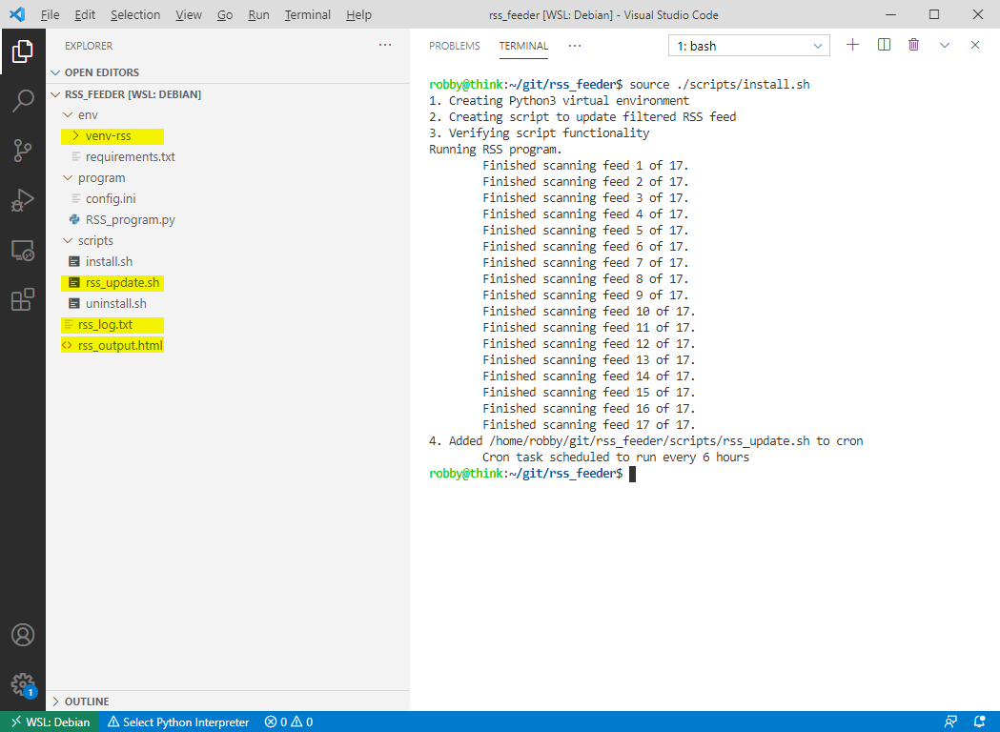
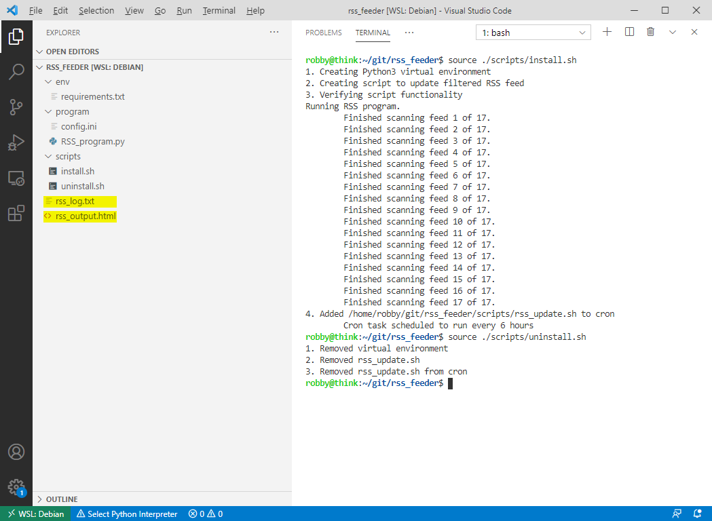

# RSS Feed Filter

## What is RSS Feed Filter?

Some websites, such as scientific peer-reviewed journals, publish RSS feeds to announce when they have new content available. However, wading through these feeds can be a bit overwhelming when most of the content isn't aligned with your interests. RSS Feed Filter allows users to filter these feeds by using keywords or author names and appends new content to an html file. Since the output is saved as html, I set the file to be the home page of my browser so that I can find new publications without actively searching.

My interests include infectious diseases, diagnostics, and biosensors, which are well represented in the example image shown below. 



## How does it work?

There are three components: a configuration file, a Python 3 program, and a cron task.

### Configuration File

The configuration file is pretty simple. You tell it:
* What RSS feeds to follow
* What keywords to look for
* What authors to look for
* What the file names should be

My full [**config file**](program/config.ini) can be found in the program folder, but here's a short example:
```ini
[RSSLinks]
Nature              = http://feeds.nature.com/nature/rss/current
Science             = https://science.sciencemag.org/rss/current.xml

[Keywords]
# No semicolon on last entry!
keyword_list        = biosensor;
                      open-source;
                      diagnostics

[Authors]
# No semicolon on last entry!
author_list         = Kiana Aran;
                      Aran, K;
                      Feng Zhang;
                      Zhang, F

[Files]
log                 = ./rss_log.txt
output              = ./rss_output.html
```

### Python 3 Program

The [**Python program**](program/RSS_program.py) is also pretty simple. It reads the config file and then scans all entries in all RSS feeds for the keywords and authors. If there is a match, it checks the log file to see if it previously discovered the article of interest. If it's a new match, the program will add the publication title and link to the output file and append the title to a log file. If it has seen the match before, it ignores it and moves on to the next one.

### Cron Task

The purpose of the cron task is to automatically check the RSS feeds every 6 hours so that you don't have to think about it. I included an [**install**](scripts/install.sh) and [**uninstall**](scripts/uninstall.sh) script that manages everything with no effort. Verified on Debian, but it should work with OSX too.

## How to get started

1. Clone or download the repository
2. Change the config file to match your interests
3. Navigate to the directory with the terminal
4. Run the following command:
```bash
source ./scripts/install.sh
```
5. To ensure that the script will auto update, confirm that cron is running. In Debian:
```bash
sudo service cron start
```
6. Open the HTML file in your browser to see your matches
7. Set the file to be your browser home page

## Tuning the Returned Results
 You might have a lot of publications listed the first day that you run the program. This is because RSS feeds can contain a full month's worth of publications and some search terms might be too broad. However, after the first day, only new content on these feeds will be discovered. 
 
 If the filter isn't giving you the results you want, change your config search terms, delete the log and html file, and run the install script again. If your interests slowly change over time, you can change the config search terms without needing to delete files.

If there is a title that you find offensive or annoying, you can delete the title and link by editing the html file directly.

## How to remove the program
1. Navigate to the directory with the terminal
2. Run the following command:
```bash
source ./scripts/uninstall.sh
```
3. The automated program was removed, but the files still exist and can be deleted!

## Process Images
### Before installing the program:


### After installing the program:


### After uninstalling the program:


## Dependencies

* Python 3
* Python 3 Module: venv
* Python 3 Module: pip
* Bash (Included in Debian and OSX by default)
* Cron (Included in Debian and OSX by default)

